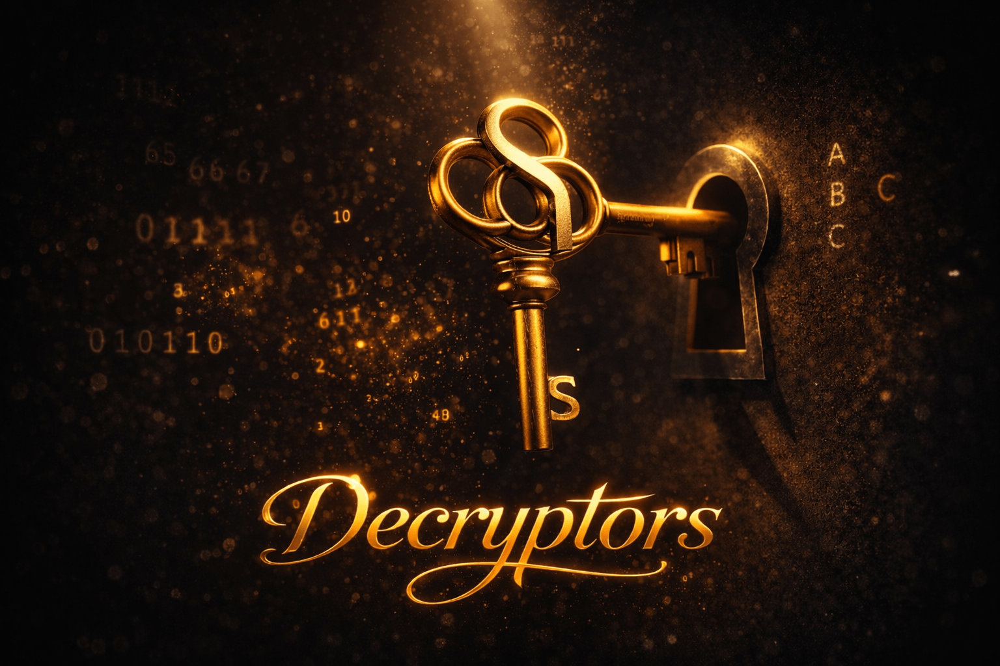

<p align="center">
  
</p>

# Decryptors

A CLI puzzle game where you decrypt hidden information through
unconventional thinking. Each level presents a unique cipher —
no linear thinking allowed.

## Puzzles
- **Level 0** — The Fruit Cipher
- **Level 1** — The Chess Cipher
- **Level 2** — The Ludo Cipher
- **Level 3** — The Three Realms
- **Level 4** — The Shape Speaks
- **Level 5** — The Cosmos Cipher
- **Level 6** — The Fable Cipher
- **Level 7** — The Binary Lock

## Requirements
A terminal with image support for the best experience:
- Kitty ✦ recommended
- Ghostty ✦ recommended
- WezTerm ✦ recommended
- iTerm2

Not supported: Alacritty, VSCode terminal, Windows Terminal, Mac Terminal

**iTerm2 users:** You may see a permission prompt for inline image display — click Yes to allow it. Check "Remember my choice" to skip it in future sessions.

A color emoji font is required for some puzzles (e.g. `noto-fonts-emoji` on Arch). Most desktop Linux distros and macOS ship one by default.

mpv is required for audio:
```bash
sudo pacman -S mpv      # Arch
sudo apt install mpv    # Debian/Ubuntu
sudo dnf install mpv    # Fedora
```

## Install & Run
```bash
git clone https://github.com/IntrovertInsaan/decryptors
cd decryptors
cargo run --release
```

## License
Code is [GPL-2.0](https://github.com/IntrovertInsaan/decryptors/blob/main/LICENSE). Puzzle content is proprietary — see [LICENSE](https://github.com/IntrovertInsaan/decryptors/blob/main/LICENSE) for details.
